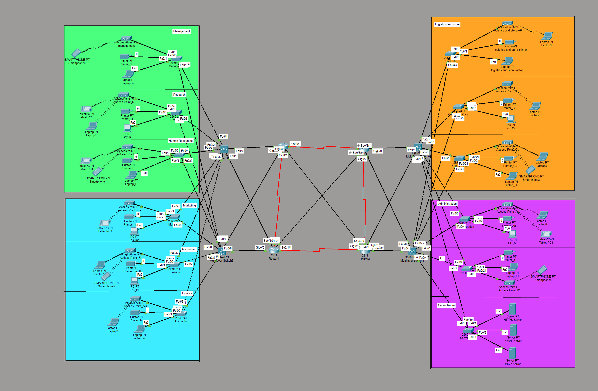

# Packet Tracer Network Design for Four Floors

## Overview
A network designed for a four-floor building, allowing the different networks on each floor to communicate with each other and access a server room that provides multiple network services.

## Technologies
- Cisco Packet Tracer
- VLANs
- Trunking
- VLSM subnetting
- RIP
- Wireless Networking
- Router and Switch Configuration

## Network Services
- DHCP
- DNS
- HTTP
- Email
- Telnet

## Testing
The network was tested using:
- Ping between different networks
- Dynamic IP address assignment using DHCP
- DNS name
- HTTP web access
- Email communication
- RIP routing table verification
- Telnet remote management of the switch
- ARP table verification

## Topology

## Authors
- **Naif Alhammadi:** Network design, router and switch configuration, trunk and rip routing, and overall project integration.
- **Ibrahim Naji:** Topology implementation and network services.
- **Aiman Alnaser:** Network testing and verification.
